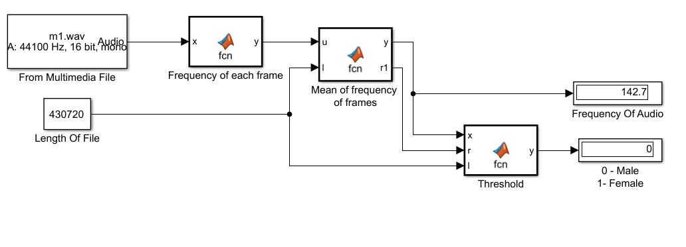

# Male-Female Voice Recognition
Recognize whether the voice is of a male ar female

## Introduction

The fundamental frequency of a typical male ranges somewhere from  85 Hz to 180 Hz. While, the fundamental frequency of a typical female ranges somewhere from 165 Hz to 255 Hz.

### Method 1 - Using in-built pitch function
                                                    [f0,inx] = pitch(audioIn,fs)
It straightway returns the fundamental frequency, f0 of any input audio file with sampling frequency fs. Thus, we can directly compare it with 165 Hz and report whether the voice is of a male or a female.

Limitation - Works only in Matlab 2018

Run **Male_Female_inbuilt_pitch.m** file to identify using this method.

### Method 2


Run **Male_Female_Voice Recognizer.m** file to identify using this method.

## Simulink Implementation



Using the *From Multimedia File* block the sample audio is taken as input with 3500 samples per audio channel. This is passed to the next block where frequency of each frame is calculated
```
function y = fcn(x)
Fs=44100;
coder.extrinsic('butter');  % To include butter function in simulink
coder.extrinsic('filter');  % To include filter function in simulink
[b0,a0]=butter(2,325/(Fs/2));
xin = abs(x);
xin=filter(b0,a0,xin);
xin = xin-mean(xin);
x2=zeros(length(xin),1);
x2(1:length(x)-1)=xin(2:length(x));
zc=length(find((xin>0 & x2<0) | (xin<0 & x2>0)));
y = 0.5*Fs*zc/length(x);
```
