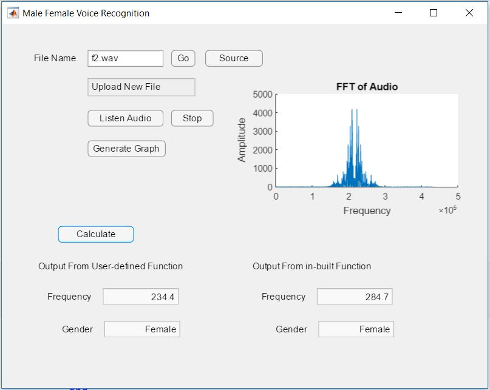

# Male-Female Voice Recognition
Recognize whether the voice is of a male ar female. A matlab based *GUI application* is also created for this project

## Introduction

The fundamental frequency of a typical male ranges somewhere from  85 Hz to 180 Hz. While, the fundamental frequency of a typical female ranges somewhere from 165 Hz to 255 Hz.

### Method 1 - Using in-built pitch function
                                                    [f0,inx] = pitch(audioIn,fs)
It straightway returns the fundamental frequency, f0 of any input audio file with sampling frequency fs. Thus, we can directly compare it with 165 Hz and report whether the voice is of a male or a female.

Limitation - Works only in Matlab 2018

Run **Male_Female_inbuilt_pitch.m** file to identify using this method.

### Method 2


Run **Male_Female_Voice Recognizer.m** file to identify using this method.

## Simulink Implementation


Using the *From Multimedia File* block the sample audio is taken as input with 3500 samples per audio channel. This is passed to the next block where frequency of each frame is calculated. Following is the code for that function.
```
function y = fcn(x)
Fs=44100;
coder.extrinsic('butter');  % To include butter function in simulink
coder.extrinsic('filter');  % To include filter function in simulink
[b0,a0]=butter(2,325/(Fs/2));
xin = abs(x);
xin=filter(b0,a0,xin);
xin = xin-mean(xin);
x2=zeros(length(xin),1);
x2(1:length(x)-1)=xin(2:length(x));
zc=length(find((xin>0 & x2<0) | (xin<0 & x2>0)));
y = 0.5*Fs*zc/length(x);
```
In the next block *Persistent* is used in order to save previous result in order to use next time. This is essential for the caculation of mean frequency.

Code:-
```
function [y,r1] = fcn(u,l)
persistent i
persistent r
if isempty(i)
        i = 0;
end
if isempty(r)
        r = 0;
end
j=l/3500;
i= (u/j)+i;
r=r+1;
r1=r;
y = i;
```
In the final block values are compared with the threshold values.

```
function y = fcn(x,r,l)
y=5;
if r>l/3500
    if x>160
        y=1;
    else
        y=0;
    end
end
end
```

As final result frequency is displayed also
```
0 - Male
1 - Female
```

## GUI Application



To open this project go to app designer and open **GUI/gui.mlapp** 

To use it as an MATLAB app install using **Male_Female_Voice_Recognition.mlappinstall**

### Guide For the App

*Source button*  - Used to select the source file. By default it is set to tske in only .wav files(can be changed either in source file)

*Go button*  -  After the selection from source button to finally select the file name shown in box, press this button

Another way is directly writing the address of that file and pressing *Go button*.

In the Message box where in the "Upload New File" is shown provides step by step procedure and errors made by the user while selecting the file and processing it further.

*Generate Graph* - Generates the FFT graph of that audio file.

**Calculate** - This button calculate the frequency using the algo proposed and using the inbuilt algo. Also it tells the gender.

Note- Even though the frequecy do not match, the gender predicted is almost same in all the test cases.


